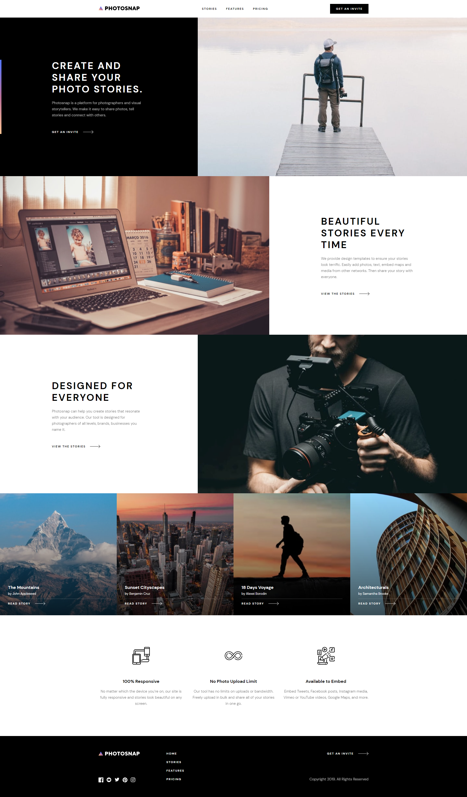

# Frontend Mentor - Photosnap Multipage Website solution

This is a solution to the [Photosnap Website challenge on Frontend Mentor](https://www.frontendmentor.io/challenges/photosnap-multipage-website-nMDSrNmNW). Frontend Mentor challenges help you improve your coding skills by building realistic projects. 

## Table of contents

- [Overview](#overview)
  - [The challenge](#the-challenge)
  - [Screenshot](#screenshot)
  - [Links](#links)
- [My process](#my-process)
  - [Built with](#built-with)

## Overview

### The challenge

Users should be able to:

- View the optimal layout for each page depending on their device's screen size
- See hover states for all interactive elements throughout the site

### Screenshot

### Links

- Solution URL: [Here](https://www.frontendmentor.io/solutions/photosnap-multipage-website-vuejs-nT_uJu9Jq)
- Live Site URL: [Here](https://hyunnies95.github.io/photosnap-multipage-website/)

## My process

### Built with

- [Vue.js](https://vuejs.org/)
- Vue Router
- BEM
- CSS Flexbox
- Mobile-first workflow
